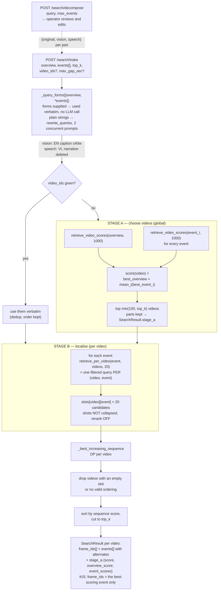
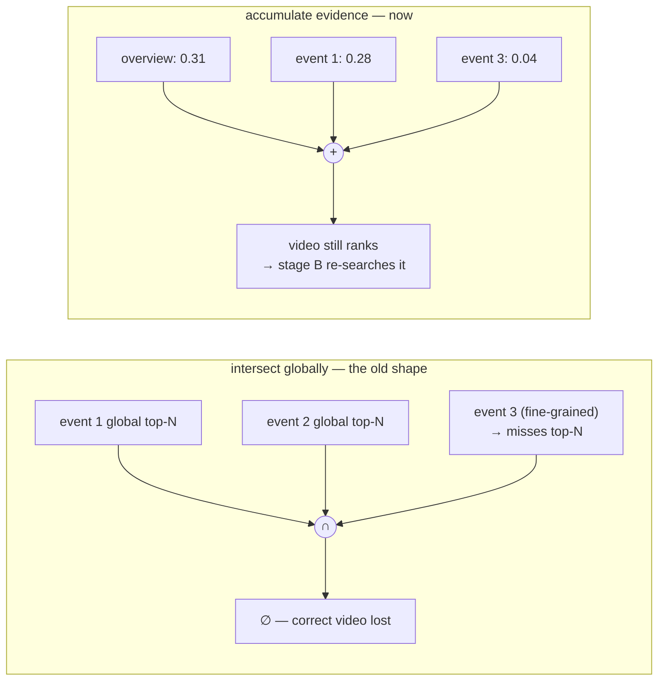
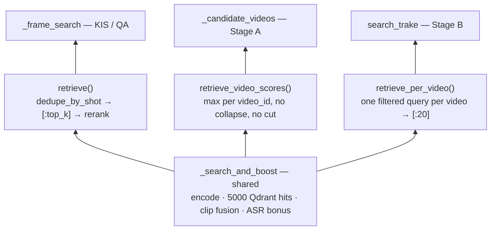
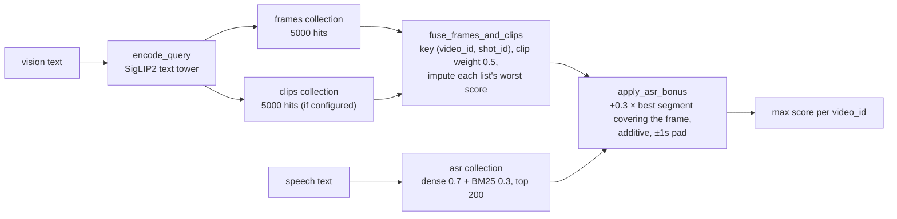
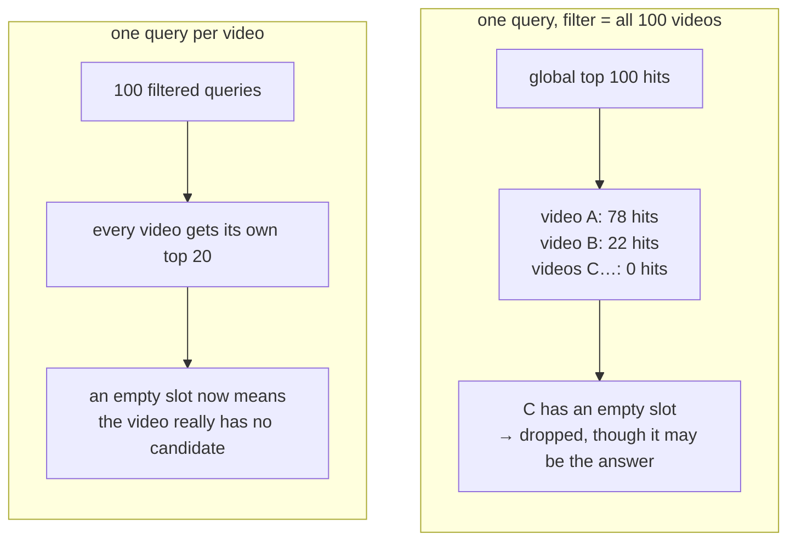
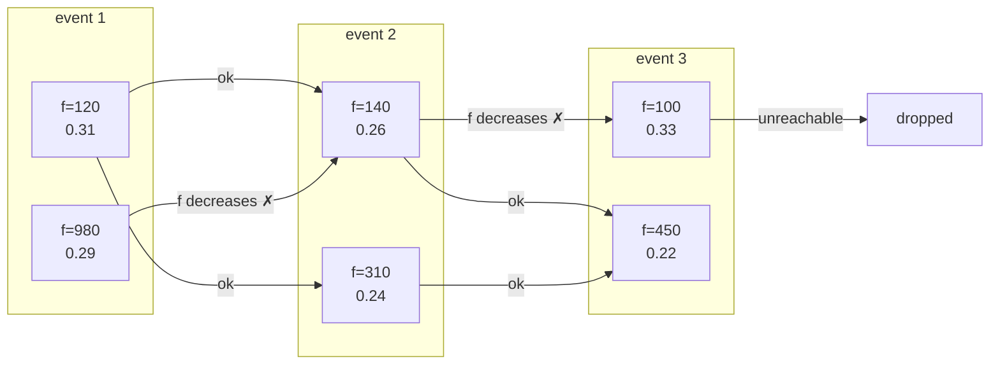

# TRAKE retrieval

How `POST /search/trake` turns an overview plus N event descriptions into ranked
frame sequences, and why each stage is shaped the way it is. `POST /search/kis`
runs the same two stages when the operator gives it events, and reports one
frame instead of the chain — see §11.

Code: [`app/retrieval/tracks.py`](../backend/app/retrieval/tracks.py)
(`_temporal_search`, `_candidate_videos`, `_best_increasing_sequence`),
[`app/retrieval/engine.py`](../backend/app/retrieval/engine.py)
(`retrieve_video_scores`, `retrieve_per_video`),
[`app/retrieval/decompose.py`](../backend/app/retrieval/decompose.py),
[`app/retrieval/rewrite.py`](../backend/app/retrieval/rewrite.py).

---

## 1. What the track has to produce

A TRAKE submission row is `video_id, frame_id_1, ..., frame_id_n` — one frame per
event, in order, inside one video
([`submissions/formats.py`](../backend/app/submissions/formats.py)). That shape
dictates everything downstream:

- A result that fills only 3 of 4 events **is not a row**. Partial sequences are
  dropped, not ranked low.
- The frames must be **strictly increasing**, because the events happen in the
  order the operator typed them.
- The ordering key is `original_frame_id` — what the submission reports, and
  monotone with time inside a video.

## 2. The one idea the design turns on

*Which video* and *where inside it* are different questions.

"Which video" is a whole-video judgement: every event is evidence about the video,
and they accumulate. "Where is event 3" only becomes a well-posed question once the
video is fixed — globally, a fine-grained moment ("the instant all four feet touch
the ground") does not reach the top of a 290k-frame ranking, and never will.

The previous design searched every event globally and intersected the results. It
lost the correct video whenever **any single event** failed to reach a global
top-N, which fine-grained events routinely do. So the path splits in two.

## 3. End-to-end



## 4. Rewrite — one batch, two prompts

Skipped entirely when the request carries `{vision, speech}` objects instead of
strings: those came from `/search/decompose` and were reviewed by a human, so
re-captioning them would throw the operator's edit away (§11). What follows is
the path a request of plain strings takes.

`[overview, *events]` goes out as **one numbered batch**, under **two prompts on two
concurrent calls**:

| form | goes to | shape |
|---|---|---|
| `Rewrite.vision` | SigLIP2 text tower + BLIP reranker | English caption, ≤40 words |
| `Rewrite.speech` | ASR transcripts (dense + BM25) | original language, narration **deleted** |

Why batched: every query is searched **twice** — once globally in stage A, once
inside each candidate in stage B. Per-query round trips would put seconds on the
clock for nothing. Measured 1.8s for an overview plus five events.

Why two calls rather than one: merged, the caption rules bled into the deletion
rules and the model variously deleted the subject of the query
(`lễ hội đèn lồng`) or deleted nothing at all. Split, wall clock is the slower of
the two, not their sum, and **each half falls back independently** — a caption that
does not arrive does not cost the cleaned form.

Every failure — box down, timeout, misnumbered line, `finish_reason != "stop"` —
falls back to the query as typed. The `finish_reason` check is load-bearing: a
truncated reply still parses, because the early lines are intact, so without it the
last event is searched as half a sentence.

## 5. Stage A — candidate videos

`_candidate_videos` searches the overview **and every event** globally, then reduces
each to one score per video. The composite and **the parts it is made of** are
reported back on every result as `stage_a`: "won on the overview, lost every
event" and its reverse score identically and mean opposite things to an operator
deciding whether to trust a video. `stage_a` is null when `video_ids` was
supplied, because the stage never ran and 0.0 would read as "matched nothing".

```
score(video) = best_overview_hit(video) + (1/n) · Σ_i best_event_i_hit(video)
```

Three decisions do the work here.

### 5.1 Coverage is deliberately not required

A video the overview alone found still earns a full alignment pass. The events get
another chance *inside* each candidate, so demanding a global hit for each one only
throws away correct videos.



### 5.2 Two reductions of the same hit list — not two branches

`retrieve` and `retrieve_video_scores` are **not two paths through one request**.
They are two functions with two different callers, and no request runs both. Both go
through the same `_search_and_boost`: same encode, same 5000-hit Qdrant search, same
clip fusion, same ASR bonus. They differ only in the **last step**.

| function | called by | last step | returns |
|---|---|---|---|
| `retrieve` | `_frame_search` — KIS / QA | `dedupe_by_shot(hits, top_k)` → `[:top_k]` → rerank | `list[ScoredFrame]`, a page of results |
| `retrieve_video_scores` | `_candidate_videos` — Stage A | `max(score)` per `video_id`; no collapse, no cut | `dict[video_id, float]` |
| `retrieve_per_video` | `search_trake` — Stage B | one filtered query per video → sort → `[:20]` | `dict[video_id, list[ScoredFrame]]` |



### 5.3 Why Stage A cannot use `retrieve`

The lossy step is `[:top_k]`, **not** the shot collapse. Collapsing to one frame per
shot actually *helps* video diversity per slot. What costs videos is that the
surviving slots are a **fixed budget allocated by global score** — and dense hits
concentrate inside a few long videos.

Go deeper in the same ranked list and new videos keep appearing, so any cut discards
every video that first appears below it. Measured on *"close-up of a white lion
head"*:

| depth into the ranked list | distinct videos |
|---|---|
| top 1000 frames | 31 |
| top 5000 frames | 277 |
| top 400 **shots** (what `retrieve` keeps) | 28 |
| **Stage A needs** | **100** |

28 cannot fill a 100-video pool. `retrieve_video_scores` never cuts, so it names
every video present in the 5000 hits. That is also why `dedupe.DEFAULT_CAP` is 5000 —
91ms against 293k points, up from 26ms at 1000.

### 5.4 Reranking is off

BLIP ITM emits probabilities running to 1.0 where cosine scores sit near 0.2. Summed
into a per-video score, the reranked head of each query's list would outweigh every
other video **by scale alone**, so picking candidate videos would come down to
whichever ones BLIP happened to see. It also cost measured seconds per request.

### 5.5 Inside one `retrieve_video_scores` call



The ASR bonus is **additive, never multiplicative**: 22 of 873 videos have no
transcript and 4.5% of video time has no segment, so silence is not evidence against
a frame. Speech top-k is pinned at 200 rather than scaled with the 1000-frame pool —
segments are already spread across ~700 of 873 videos in a top-1000 list, so
widening it only cost a second per query for a bonus that reorders near-ties.

## 6. Stage B — localise inside each candidate

For each event, `retrieve_per_video(event.vision, videos, 20, ...)`: one encode, then
**one filtered Qdrant query per video**.

### 6.1 Why not one query filtered to all 100 videos

Because that returns the global top-N *across* them, and starves a correct video that
ranks low overall — the same recall failure the two-stage split exists to fix, one
level down.



That is what makes the "drop any video with an empty slot" rule safe: after stage B
an empty slot means the video genuinely has nothing for that event, not that the
event lost a global ranking.

### 6.2 Shots are not collapsed here

`dedupe_by_shot` keeps one frame per shot. Two events of a TRAKE query can happen
inside one two-second shot, so collapsing would make that sequence **unrepresentable**
rather than merely rank it worse.

### 6.3 Reranking is off here too

The cross-encoder head covers the top `rerank_top_n` (30) of *one global list*, so
against per-video candidate sets it would rescore an arbitrary slice of them. Making
it meaningful costs one forward pass per (video, event, candidate). The video is
already chosen by here, and within one video the dense space is what separates its
own frames.

### 6.4 One speech query for the whole candidate set

`apply_asr_bonus` min-max normalises the segments it is handed. Boosting each video
from its own segment list would make the bonuses **incomparable between videos** —
which is exactly what ranking the sequences needs. So: one speech query filtered to
all candidates, one bonus pass over the flattened hits, then re-split per video.

## 7. Alignment — `_best_increasing_sequence`

Per video, choose one candidate per event maximising

```
mean(event scores) − gap_weight · mean(gap penalty)
```

subject to two hard constraints:

1. `representative_frame` **strictly increasing**
2. `pts_sec` gap between consecutive picks ≤ `max_gap` (default 300s; `0` disables;
   skipped when either timestamp is missing, since a missing time is not evidence
   that the events are far apart)

`_gap_sec` is the single source of truth for "do we know the gap"; both the hard
cutoff and the penalty read `None` as *no information*, never as far apart or
adjacent.



Chosen chain: `120 → 140 → 450`. With `pts_sec` of 4.0, 4.6 and 19.0 the two gaps are
0.6s and 14.4s, so at `gap_weight = 0.05` the score is

```
(0.31+0.26+0.22)/3 − 0.05 · (0.082 + 0.479)/2  =  0.2633 − 0.0140  =  0.2493
```

Division by the event count keeps sequences of different lengths on one scale, and the
per-edge weight is pre-scaled by `n/(n−1)` so `gap_weight` means the same thing at any
event count — otherwise a weight tuned on two events would land 1.6× harder on five.

### 7.1 Why the gap penalty is a soft term and not a tighter cutoff

`max_gap` alone is binary: inside the window a 1-second gap and a 299-second gap
scored identically, which is wrong for a query describing one continuous action. The
penalty is `log1p(gap) / log1p(TRAKE_MAX_GAP_SEC)` — 0 at no gap, 1.0 at 300s, above 1
beyond that with no clamp, since a bigger gap really is worse.

Normalised by the **module constant**, never by the request's `max_gap_sec`: an
operator who sets that to `0` has disabled the cutoff, not asked for spread events to
rank as well as tight ones — the penalty is the better version of the rule they just
turned off. It would also divide by zero.

`log1p` is steepest near zero, so it separates small gaps sharply and large ones
barely. With the cutoff that is the right division of labour: the cutoff rejects the
absurd, the penalty ranks the plausible.

At `gap_weight = 0.05` a 300s gap costs 0.05 against event scores of 0.15–0.35 — it
reorders near-ties and cannot outvote a clearly better frame, the same posture the ASR
bonus takes. `EventHit.score` stays the event's own similarity, **not** net of the
penalty: the penalty belongs to the sequence, not to one pick.

### 7.2 The DP stays exact, but the predecessor choice had to change

The penalty puts a cost on the **edge** between two picks, so it must be charged
*before* a predecessor is chosen. Taking the best-scoring chain and paying the gap
afterwards is a greedy step and returns the wrong answer whenever a slightly worse
predecessor sits closer in time:

| event 1 candidate | score | frame | `pts_sec` | net of the edge to `f=30` |
|---|---|---|---|---|
| A | 0.50 | 10 | 0.0 | `0.50 − 0.10·0.817` = **0.418** |
| B | 0.48 | 20 | 100.0 | `0.48 − 0.10·0.314` = **0.449** |

B wins on the lower raw score. Folding the edge cost into the value being maximised
keeps the search **exact**: feasibility *and* edge cost both look only at the previous
candidate, which leaves "best total ending at candidate *j*" a sufficient state.
Complexity is unchanged, `O(Σ |slotᵢ| × |slotᵢ₊₁|)`.

`max_gap` still exists because the events of one TRAKE query describe a single
continuous action — without it a chain spanning a 40-minute video is not rejected at
all, only mildly penalised.

Ordering is on the frame id, not `pts_sec`, because that is what a submission reports
and it rises with time inside a video anyway. Seconds are used **only** for the gap,
which is a duration and so cannot be expressed in frames when videos differ in frame
rate.

### 7.3 Alternates

`_event_hits` reports, per event, the runners-up the pick beat — held to the *same*
two rules against the **neighbouring picks**: after the previous event, before the
next, within the gap. Offering a candidate the ranker would have rejected would let
an operator hand-assemble a sequence the system does not consider a sequence, and
submit it out of order.

They are also **ranked by what the swap would cost** — `score − gap_weight ·
(penalty to the previous pick + penalty to the next)` — which is no longer score
order once a gap carries a penalty. A slightly worse frame seconds from its
neighbours beats a better one minutes away, and listing them by score would
recommend the swap the sequence search itself ranks worst. Absent neighbours (the
first and last events) contribute nothing.

## 8. The knobs

| constant | value | what it buys | when to move it |
|---|---|---|---|
| `TRAKE_VIDEO_CANDIDATES` | 100 | ceiling on the alignment pool; a submission ranks 100 lines and the track returns ≤1 result per candidate. The pool is `min(this, top_k)` — a result needs a candidate to live in, so aligning more videos than the operator asked for rows is work that cannot produce one | the cost dial — stage B is `videos × events` serial round trips |
| `MAX_DECOMPOSED_EVENTS` | 6 | cap on events inferred from prose by `/search/decompose`; a query that enumerates its own (`E1:`) is not capped | raise only with the latency in §10 in mind — every event multiplies stage B |
| `TRAKE_STAGE_A_TOP_K` | 1000 | frame pool per stage-A query; `overfetch_limit` lifts it to 5000 raw hits | recall of the video pool |
| `TRAKE_CANDIDATES_PER_EVENT` | 20 | candidates per event **inside one video** | when the DP has no valid ordering but the event is visibly present |
| `TRAKE_ALTERNATES_PER_EVENT` | 5 | runners-up offered to the operator | UI only, free |
| `TRAKE_MAX_GAP_SEC` | 300.0 | widest gap between consecutive events | per request via `max_gap_sec`; `0` disables |
| `TRAKE_GAP_WEIGHT` | 0.05 | what separation costs, as a share of the sequence score; also the normaliser for the penalty | per request via `gap_weight`; `0` disables. Raise if spread sequences still win; if candidate *videos* change, it is far too high — Stage A never sees it |
| `STAGE_A_SPEECH_TOP_K` | 200 | speech segments matched in stage A | pinned deliberately, see §5.5 |
| `asr_weight` | 0.3 | share of a frame's score speech can add | per request |
| `DEFAULT_CLIP_WEIGHT` | 0.5 | clip index as tie-breaker and recall net, never an outvote | |

## 9. What is off, on purpose

| stage | shot dedupe | rerank | coverage required |
|---|---|---|---|
| Stage A (choose video) | **no** — collapsing names too few videos | **no** — ITM 1.0 vs cosine 0.2 | **no** — loses correct videos |
| Stage B (localise) | **no** — two events can share a shot | **no** — head covers one global list | **yes** — a partial sequence is not a row |
| KIS/QA (`_frame_search`) | yes | yes | n/a |

## 10. Ceilings

- **Latency.** Stage B is serial in both loops: `for event` in `search_trake`, then
  `for video_id` inside `retrieve_per_video`. 100 videos × 5 events = 500 sequential
  Qdrant round trips. `TRAKE_VIDEO_CANDIDATES` is the only dial today.
- **Localisation granularity.** Only as fine as the keyframes — three per shot, so a
  sub-second moment is *bracketed*, not pinned. `events[].alternates` exists so an
  operator closes that gap by hand. Asking the VLM *where* inside a bracketed shot an
  event sits is the obvious next lever.
- **Nothing here is fitted.** `TRAKE_GAP_WEIGHT = 0.05`, `TRAKE_MAX_GAP_SEC = 300`
  and stage A's `best_overview + mean(best_event)` are all reasoned from the score
  scale, not measured — and the mean is now taken over as many as six *inferred*
  events against a *synthesised* overview (§11), which is a different input
  distribution from the one they were reasoned for.
  `data/evaluation_set_p1.csv` is where that gets settled: 24 queries, of which 3
  are TRAKE with frame-level ground truth (`video_id` + the exact `frame_ids`, some
  with several acceptable tuples) and 18 are KIS whose ground truth is a *set* of up
  to 10 acceptable frames. It has not been run against this path yet.
- **The gap penalty is most generous exactly where a degenerate sequence sits.**
  `log1p` is steepest at gap→0, and Stage B deliberately does not collapse shots so
  that two events *can* share one two-second shot. A chain where the same visual
  matched all n events therefore lands in the cheapest region. If that shows up, the
  fix is a floor below ~1s, not a different curve — there is nothing to fit one
  against today.
- **Rewrite timeout is flat** (`rewrite_timeout_sec = 6.0`), not `base + n × per_query`
  — a ten-event batch is output-token-bound and can outrun it. Marked `ponytail:` in
  `engine.py`.
- **`retrieve_video_scores` is called `1 + n_events` times**, each pulling 5000 raw
  hits; stage A cost grows linearly with the event count.

## 11. Decomposition and temporal KIS

An operator pastes the task as the competition wrote it, `POST /search/decompose`
splits it, and **the operator reads the split before anything is searched**. A
wrong decomposition costs the whole task, and it is only visible if someone can
see it next to the words it was cut from — which is why the search endpoints do
not decompose for you.

### 11.1 Two paths into the split

| the query | how it splits | what the LLM does |
|---|---|---|
| enumerates its events (`E1:`, `E2:` …) | `split_markers`, a regex | captions only |
| prose ("phân cảnh tiếp theo…") | one decomposition call, capped at `max_events` | splits, deletes narration, captions |

Marker splitting is not just cheaper — it is the version that cannot renumber or
merge. `query-p1-18-trake` in the eval set is numbered **E1, E2, E2, E4**; it has
four events, and counting *marker lines* says so while trusting the numbers does
not. The split also keeps the operator's words exactly, which is what the speech
form wants anyway.

### 11.2 Which call runs beside which

Both paths end at one caption call over `[overview, *events]`, and it is **not**
`rewrite.CAPTION_PROMPT`: that prompt captions each line alone, and
`E2: Khoảnh khắc 4 chân hoàn toàn chạm đất` alone describes nothing. The event
caption prompt sees the overview on line 1 and carries the scene's lasting detail
— the lion, its colours, the floor — into every caption, because each one is
searched alone against single frames.

- **Markers**: the split is already done, so `CLEAN_PROMPT` (speech) runs *beside*
  the caption call. Wall clock is the slower of the two.
- **Prose**: the split *is* the deletion — each event is a span of the operator's
  own words — so the decomposition call produces the speech form itself and the
  caption call runs *after* it. Serial on purpose: two calls that each decompose
  independently can return different counts and boundaries, and the two forms are
  paired positionally, so event 3's caption would be searched against event 2's
  speech. It costs a second on a screen where a human is reading.

### 11.3 Failure is not uniform

| what failed | result | why |
|---|---|---|
| prose decomposition | **503** | it is the entire product of the call; a 200 carrying a decomposition nobody performed is the failure you cannot see on a screen |
| more events than `max_events` | **503** | the tail of these descriptions is where the distinguishing detail sits, so truncating is worse than asking again |
| the caption call | **200**, `vision: null` | retrieval puts the original-language text through the image tower — worse than a caption, much better than nothing |
| `CLEAN_PROMPT` (marker path) | **200**, speech as typed | deletion is an improvement, never a dependency |

### 11.4 Temporal KIS

`POST /search/kis` with `overview` + `events` runs everything above and reports
**one frame**: the highest-scoring event of the aligned chain. Not the overview's
frame — "cảnh trang trí bánh rán" is the least discriminative string in the query
and exists to select the video. The alignment already puts every event in one
compact, in-order run inside the chosen video, and KIS ground truth is a *set* of
acceptable frames covering the described action, so all of them are in the window
and the best-scoring one is the moment the model is surest it saw. The full chain
still rides along in `events[]` for a one-click override.

The operator opts in; nothing is auto-detected. What it buys is that a
description walking through phases stops being averaged into a single 40-word
caption — each moment votes on the video on its own.
